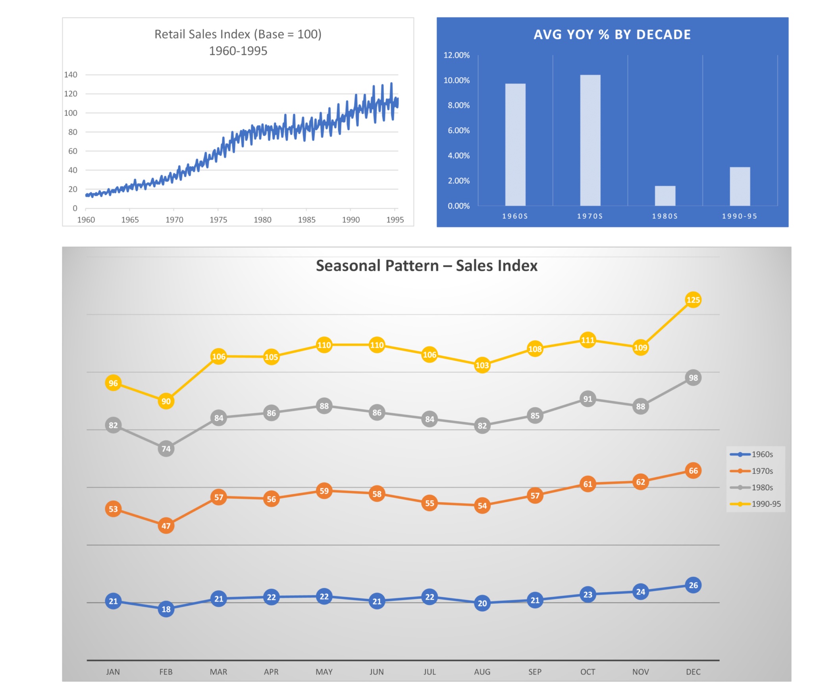

# Darren Littlejohn Portfolio Website

*Conceived, designed, and delivered with AI agent Violet, part of OpenClaw Mission Control.*

## About This Project

This website serves not only as a portfolio but as a communication tool aimed specifically at healthcare data analyst hiring managers. It documents Darren's thinking process, design decisions, and communication skills demonstrated throughout the development.

## Project Origins

Developed initially with the help of the Antigravity deployment framework, the project was transitioned under the expert guidance of Violet — a strategic, psychology-aware design agent dedicated to optimizing the site for job hunting success.

## Development Approach

- **Agent-Driven Design:** Violet leads the visual layout, copy refinement, and overall messaging to appeal to recruiters and hiring managers.
- **Iterative Development:** Each iteration focuses on aligning the site with targeted keywords from the healthcare data analyst job market to maximize recruiter engagement.
- **Transparent Workflows:** The README serves as a transparent narrative of problem-solving and communication ability throughout the development.

## Communication and Thinking Demonstrated

- Clear articulation of goals and constraints (e.g., survival-mode urgency, target employer awareness)
- Strategic choices in content and presentation to highlight analytical skills
- Evidence of cross-disciplinary thinking, combining tech, design, and job market understanding

## How to Use

- Review this repo as a testament to Darren's capability to blend data analysis with communication and design.
- Visit https://darrenlittlejohn.com to see the live site optimized by Violet.

---

*Violet is an AI agent operating within OpenClaw Mission Control, dedicated to making Darren’s portfolio a standout job hunting asset.*

---

Thank you for considering Darren Littlejohn for your healthcare data analyst role.  
Feel free to reach out with any questions or interview opportunities.

---

_Last updated: 2026-03-31_