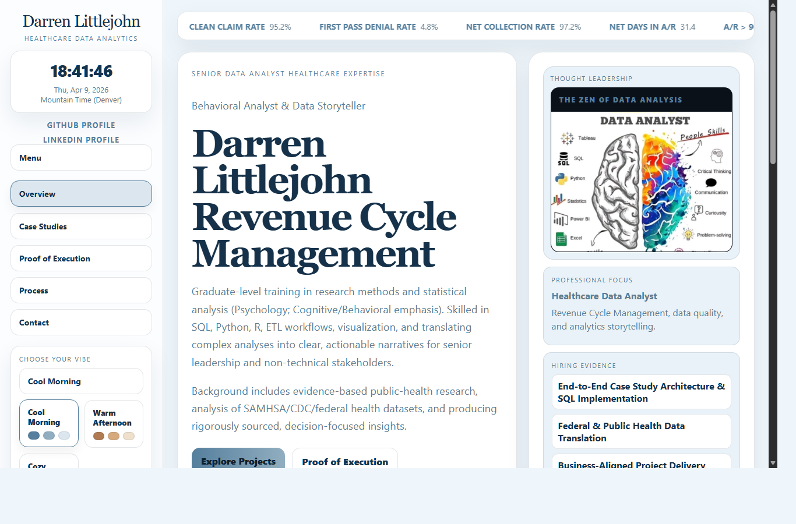

# Darren Littlejohn Portfolio Website

  

This repository is the public portfolio layer for Darren Littlejohn's healthcare analytics work.

It exists to turn completed analysis, case studies, and portfolio strategy into a recruiter-readable website that shows analytical thinking, communication, and execution discipline in a format hiring managers can review quickly.

## Purpose

The site supports one hiring goal: a Healthcare Data Analyst role.

Its job is to present:
- healthcare-relevant case studies
- clear analytical communication
- project framing that connects methods to business value
- visible proof of execution across SQL, analytics workflow, documentation, and presentation

This repo is not just a website repo. It is the public-facing delivery layer of a larger portfolio system.

## What This Repo Demonstrates

This project is designed to show more than front-end output.

It demonstrates:
- portfolio architecture for a healthcare analytics job search
- translation of technical work into recruiter-readable project pages
- structured case study presentation
- mobile-first debugging and runtime verification
- disciplined iteration using agentic AI as a build partner

The site is meant to make the work legible fast:
- what the project is
- why it matters
- what was done
- what evidence supports it
- why a hiring team should care

## How The Site Is Built

The site is developed in staging first and then promoted to production.

Core operating pattern:
- build locally in the staging version
- validate layout and behavior on desktop and mobile
- record decisions and failures in the wiki
- upload the exact changed files to production
- verify live output after deployment

The front page and project pages use a shared structure:
- shared styling in `css/demo4.css`
- shared interaction logic in `js/demo4.js`
- template-based project pages in `projects/`

This keeps the site consistent while allowing new project pages to be added without redesigning the system each time.

## Workflow And Agentic AI Use

This repo is built through an agent-assisted workflow, but the process is controlled and documented.

Agentic AI is used here for:
- layout iteration
- copy refinement
- debugging support
- mobile behavior fixes
- verification support
- documentation and writeback

The workflow is not "ask AI for a site and publish it."

The actual method is:
- Darren defines the hiring goal, portfolio direction, and constraints
- Codex assists with implementation, debugging, and structured iteration
- important decisions, successes, and failures are written back to the wiki
- the site is refined as a portfolio artifact with real review standards

This matters because the process itself is part of the evidence:
- instruction discipline
- debugging discipline
- deployment awareness
- ability to use AI as an operational tool instead of a gimmick

## Problems Solved In This Repo

Recent work in this repo has included:
- fixing mobile layout issues across homepage and project pages
- standardizing project-page behavior using a shared template pattern
- correcting timezone display to `Mountain Time (Denver)`
- removing unnecessary project-page UI clutter
- improving mobile readability and text overflow handling
- diagnosing production mismatch between local staging and DreamHost live files

One important lesson from this repo:
local success is not enough.

A page can look correct in staging and still fail in production because of:
- wrong file uploads
- stale live assets
- long-lived CSS/JS caching
- file/version mismatch between local and server

That is why this repo now depends on exact file-level deployment discipline.

## Relationship To The Larger Portfolio System

This repo is one part of one system.

Working rule:
- build in the project repo
- remember in the wiki
- sell the work through recruiter-facing assets

Within that system:
- this repo is the public website
- the wiki stores durable memory, workflow notes, and lessons learned
- related project repos hold deeper analysis and source work

The website is where the work becomes legible to an employer.

## Live Site

Live site:
- https://www.darrenlittlejohn.com

Local staging is used to validate design, interaction, and content changes before production upload.

## Repo Role

This repository should continue to show:
- strong judgment
- readable project communication
- healthcare analytics positioning
- careful iteration
- visible evidence of execution

The site is not separate from the portfolio.
It is the presentation layer of the portfolio.

## Current Site Screenshot

